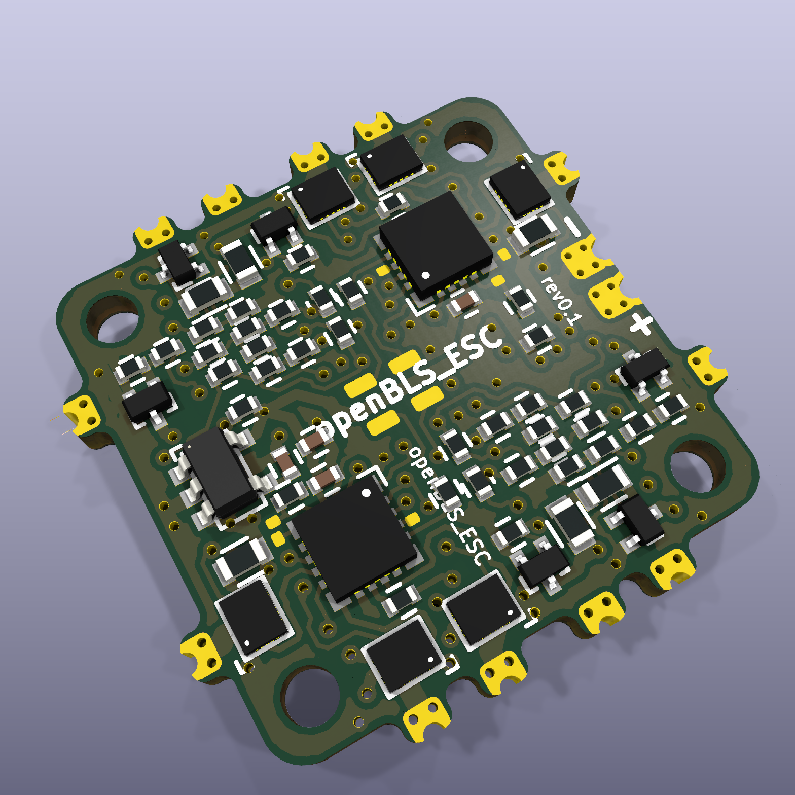

# openBLS_ESC -- a tiny and lightweight 4in1 BLHeli_S ESC -- 2S edition

Forked from [fishpepper's tinyPEPPER2](http://fishpepper.de/projects/tinyPEPPER2) and updated to build with a current version of KiCad.

The outer dimensions are 20x20mm with a 16mm hole-to-hole spacing.
Of course it also runs BLHELI_S.

Key features:
- 16x16mm hole-to-hole spacing
- 1.4g (!)
- BLHeli_S with DSHOT300
- 1S or 2S operation
- 4.8 A continous current

This work is published under the CERN open hardware license v1.2. 
Feel free to use the design - but make sure to give proper credit 
and release all modifications under the same license! 
See LICENSE.txt for details!

THIS COMES WITH NO WARRANTY! BUILD, FLY, AND USE AT YOUR OWN RISK!

# Build your own

Make sure to init the git submodule for the libraries in the
kicad_misc directory by calling git submodule init && git submodule update.
You will have to use a recent kicad version, i used the commit #efdfaeb
when i designed this circuit board. Older versions will probably not work.

